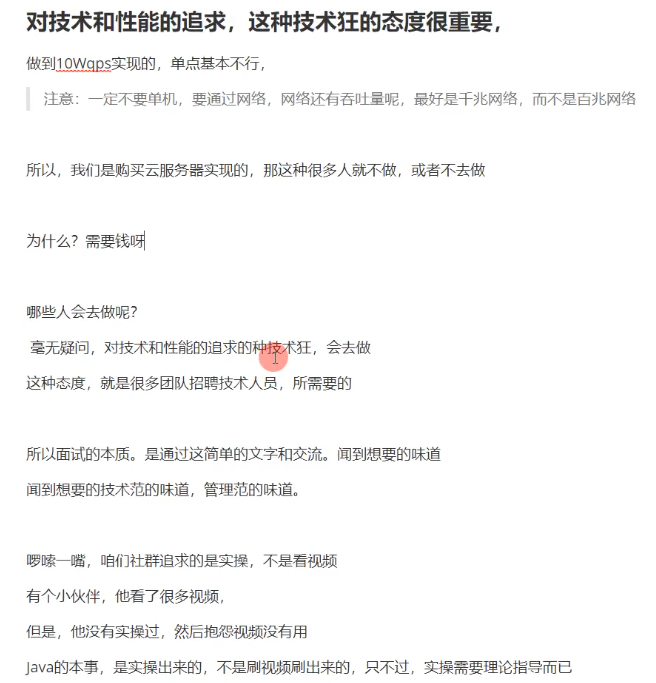

# 亿级秒杀系统

**扔掉手机 用笔记本学习**

学习

## 场景

### 用户

### 秒杀点击

### 付款


## 几个维度分析


# 三高设计

- 知识图谱

- 高性能 
  - jvm优化
  - 无锁编程
  - 高性能
  - 线程池

- 高可用 
  - 目标 
  - 手段

- 高并发
  - 缓存
  - 分布式锁
  - 限流
  - 降级
  - 接入层高并发
  - 数据一致性
  - 数据库高并发
  - 动态伸缩
  - 其他策略
    - 读写分离
    - 异构索引
    - 填谷削峰
    - 隔离策略 

# 秒杀实战 核心

## 功能分离

- 业务 ddd实战 方式设计秒杀系统
  - ddd 划分核心域, 区分核心功能和非核心功能
  - 按照流量特点划分  流量突发和流量平缓的策略
  - 功能隔离保证 互不影响
  - 功能降级   手动或者自动降级
- 数据
- 流量
  - 案例分析
  - 实时监测

# 秒杀环境启动

- 启动openrestry
- 启动rocketmq
  - sh mqnamesrv
- 启动zuul
- 启动configserver
- 启动seckill provider
- 启动stcok provider
- 启动uaa provider

## 体验步骤

启动 stock-provider

zuul

seckill provider

openresty


操作界面

cdh1:8080/views/seckill.html

秒杀暴露

cdh1:8888/swagger-ui.html


秒杀启动配置文件

/etc/rc.local


java 配置文件

/etc/profile

```shell
export JAVA_HOME=/usr/local/java/jdk1.8.0_121
export CLASSPATH=.:$JAVA_HOME/lib/dt.jar:$JAVA_HOME/lib/tools.jar
export PATH=$JAVA_HOME/bin:$PATH
export VIRTUAL_IP=cdh1
export SCAFFOLD_DB_HOST=cdh1
export SCAFFOLD_DB_USER=root
export SCAFFOLD_DB_PSW=123456
export SCAFFOLD_REDIS_HOST=$VIRTUAL_IP
export SCAFFOLD_REDIS_PSW=123456
export SCAFFOLD_EUREKA_ZONE_HOSTS=http://$VIRTUAL_IP:7777/eureka/
export RABBITMQ_HOST=$VIRTUAL_IP
export SCAFFOLD_ZOOKEEPER_HOSTS=$VIRTUAL_IP:2181
export LUA_PATH="./?.lua;$ZBS/lualibs/?/?.lua;$ZBS/lualibs/?.lua"
export LUA_CPATH="$ZBS/bin/linux/x64/?.so;$ZBS/bin/linux/x64/clibs/?.so"
export redis_host=$VIRTUAL_IP
export redis_pwd=123456
export KAFKA_HOME=/work/kafka_2.11-1.0.2
export KAFKA_HEAP_OPTS="-Xmx256M -Xms128M"
export LC_ALL=en_US.UTF-8
export LC_ALL=en_US.UTF-8
```


## openrestry日志

[root@cdh1 vagrant]# find ./ -name "error.log"
./LuaDemoProject/src/logs/error.log
[root@cdh1 vagrant]# vim ./LuaDemoProject/src/logs/error.log

#user  nobody;
worker_processes  1;

#开发环境
error_log  logs/error.log  debug;


## lua远程调试

https://www.cnblogs.com/crazymakercircle/p/12115651.html


# 秒杀设计核心

## 业务解耦

## 系统分层

### 常见互联网分层架构

客户端层: pc浏览器 手机app h5页面

接入层: 负载均衡 异地多活

服务层: 服务治理 服务隔离 服务降级 服务流控

缓存层: 一级缓存 二级缓存

数据库层: 结构化db 异构数据

中间层:  zk mq 


- 秒杀系统的分层过滤

经过cdn,nginx(商品详情),微服务和数据库

采用漏斗形过滤模型

分层过滤原则

1. cdn过滤大量图片,静态资源的请求
2. 读请求尽量命中缓存,不去查询数据库
3. 尽量讲动态读数据请求,命中在三级或二级缓存,过滤掉无效数据
4. 写入操作进行填谷削峰,提高写入吞吐量
5. 分层限流,防止雪崩

- 封层架构 幂等性原则

相同接口调用一次或多次这个请求, 返回一致的结果


## 异地多活

- ### 单元化

## 流量架构

### 流量预估

不同用户量和不同场景下的吞吐量(qps)

不同用户量和不同场景各个组件的部署架构

### 十万 百万 千万 亿级压力评估

### 各个组件并发能力参考值

### 流量规划!!

## 存储架构

qps 每秒处理查询数

tps 每秒处理事务数

iops 每秒磁盘io次数


## 实操服务层


## 思考

## ddd设计秒杀

人的因素 数量 亿级 百亿级

网络架构

百亿用户读

百亿用户写

数据库架构


# nginx和lua开发调试

[nien windows环境调试方法](https://blog.csdn.net/crazymakercircle/article/details/103747012)

Openresty是基于nginx与lua的高性能web框架，继承了大量的高质量的lua库、第三方模块以及大多数依赖项。

[ZeroBrane Studio](http://studio.zerobrane.com/)已被用于调试各种Lua引擎 – 游戏框架（如Corona，Gideros，Moai，Love2d），[家庭自动化设备](http://notebook.kulchenko.com/zerobrane/debugging-on-vera-devices-with-zerobrane-studio)，wirehark [脚本](http://notebook.kulchenko.com/zerobrane/debugging-wireshark-lua-scripts-with-zerobrane-studio)，Adobe Lightroom插件等 – 但是已经有几种Lua环境没有尝试过

## lua操作redis

- redis 数据结构

- lua 返回值说明

  ```
  --返回值说明
  --1 排队成功
  --2 秒杀库存没有找到
  --3 人数超过限制
  --4 库存不足
  --5 排队过了
  --6 秒杀过了
  ```

## lua操作redis命令

库存没有找到

##  首先要增加秒杀商品库存

[使用swagger增加商品](http://192.168.56.121:7711/stock-provider/swagger-ui.html#/%E5%95%86%E5%93%81%E5%BA%93%E5%AD%98/findAllUsingPOST)

[/api/seckill/sku/add/v1](http://192.168.56.121:7711/stock-provider/swagger-ui.html#/operations/商品库存/addSeckillUsingPOST)

增加秒杀商品

## 1. 复杂流程 使用swagger暴露秒杀成功 (091)

## 

[/api/seckill/sku/expose/v1](http://192.168.56.121:7711/stock-provider/swagger-ui.html#/operations/商品库存/exposeUsingPOST)

暴露商品秒杀


获取exposedkey ,在后面使用秒杀

加载lua脚本到redis中


## 2. 依据用户id和 exposedkey 获取令牌


## 3. 开始秒杀


## jpa自动建表


## 数据结构

库存数量  seckill stcoke 

商品id  seckill sku

hash 结构 , 秒杀 seckill queue , 用户和exposekey

脚本摘要 保存lua脚本

限流的lua脚本


# 简历

## 专业技能成功案例


## 项目经验成功案例


服务总线

## 学习项目


## **一定要实操**


## 对技术性能 有自己追求




遇到的问题 解决方案

## 简历模板


# 能像写代码一样写PPT?

[方法](https://www.cnblogs.com/crazymakercircle/p/14372042.html)


# 快捷键

ctrl f12 查看所有函数


# 分布式事务


# nginx lua redis 环境(093)

### centos 安装 openrestry环境

​	[调试环境配置教程](https://www.cnblogs.com/crazymakercircle/p/12112568.html)

​	lua的初衷本就是是作为一个嵌入式语言，为了这个目的，它的一切都是减无可减，拿来写大点儿的东西，就会感觉老是要自己发明轮子。比如，python方便好用的slice操作，lua就没有。
​	python 3的好处就是轮子基本上都发明好了，而且语言本身也有一堆语法糖让你用起来方便快捷。
​	但是如果项目需要一个嵌入式脚本引擎的话，我还是会选择lua的。所以lua和python基本上应用领域不冲突，有需要的话，俩都学其实也不错，并不用费多少功夫。

### 开发环境 idea emmylua

### 启动openrestry


## lua redis 令牌发放 库存预减(094)

## rocketmq 进行削峰(095)

## id生成算法(096)  核心编程卷1 13.4

zk cp 强一致 (不能在10万到 百万级别) , 用于生成分布式服务节点id

[阿虎 测试 benchmark 400万 开源代码 ]() jmh基准测试

​	> jmh方法测试  https://blog.csdn.net/weixin_43767015/article/details/104758415

雪花算法 64bit  每毫秒400万

**卷1 源码 , snowflakIdTest**


## jedis+lua 分布式分段锁 博文(097)

解决 订单超卖问题  跨jvm资源征用问题

setnx  如果key存在,  则key 为x

expire  设置key 锁定 几秒

**lua 在redis中执行脚本是原子性的**

lock.lua redis 加锁脚本

ctrl - shift n 打开文件

#### 问题


## redis分段锁(098)


## 高并发 mysql热点行 更新问题应对


# github watch star fork作用

watch 跟踪变化 邮件通知

star 点赞

fork 修改问题 pull给作者

[github中的watch、star、fork的作用](https://www.cnblogs.com/bibi-feiniaoyuan/p/9519467.html)
