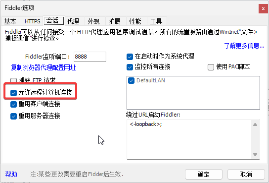

# Table of Contents

1.  [web开发调试技巧](#orga7adb51)
    1.  [抓包方法](#org95f43b6)
        1.  [fiddle](#org1c149a3)
        2.  [wireshark](#orgaf4035b)
    2.  [chrome dev工具](#orgf3d64db)
    3.  [抓包到idea http reqauest](#orgc0f3ab7)
        1.  [如何实现局部变量的传递？](#orgb018e92)
    4.  [emacs 截图报错](#orgdd5e4bc)

# web开发调试技巧

## 抓包方法

### fiddle

fiddle可以设置代理，浏览器配置完代理后，就可以通过fiddle对返回报文进行修改。
设置方法:

注意：浏览器的代理要设置到fiddle上，才能进行返回报文的修改

### wireshark

追着http流后就是标准的http协议

## chrome dev工具

1.  Block request URL

说明： 这个选项允许你阻止某个特定的 URL 请求。你可以选择某个请求的 URL，点击 "Block request URL" 来防止该请求再发起。
使用场景： 如果你想阻止某些不必要的请求（例如广告、追踪器等），或者你需要在调试时阻止某些资源加载，可以使用此功能。

1.  Block request domain

说明： 这个选项允许你阻止来自某个域名的所有请求。例如，如果你不希望来自某个特定域的所有请求被发送，选择该域名并点击此选项即可。
使用场景： 当你想要屏蔽某个网站或服务的所有请求时（如广告、第三方请求），可以使用此功能。

1.  Replay XHR

说明： 这个选项允许你重新播放某个已经完成的 XHR（XMLHttpRequest）请求，重新发起它并观察响应。
使用场景： 如果你想重复某个请求来验证问题或调试某个 API 请求的结果，可以使用这个功能。

1.  Sort By

说明： 该菜单可以帮助你对网络请求进行排序，可以按时间、请求大小、响应时间等进行排序。
使用场景： 当你需要对请求列表进行管理，方便查找请求或对请求进行分析时，可以使用此功能。

1.  Header Options

说明： 这个选项允许你查看和配置请求头的选项，特别是 HTTP 请求头和响应头。
使用场景： 在调试过程中，你可能需要查看请求或响应的详细头部信息，例如调试 API 请求时，查看认证信息或内容类型时，可以使用此选项。

1.  Override headers

说明： 该选项允许你覆盖某些请求头。你可以为请求设置自定义的请求头。
使用场景： 如果你需要模拟不同的请求头（例如修改 User-Agent、Authorization 或其他自定义头部），可以使用此功能来进行测试。

1.  Override content

说明： 这个选项允许你覆盖请求或响应的内容。你可以直接修改请求的负载或服务器的响应内容。
使用场景： 在测试或调试时，如果你想改变请求体或响应体来测试不同的场景，可以使用这个功能。

1.  Copy request headers

复制请求的头部信息，头部包含了请求的元数据，例如认证信息、内容类型等。
使用场景： 在调试时，你可能需要查看或修改请求头部信息，尤其是调试 API 请求时。

1.  Copy response headers

复制服务器响应的头部信息。
使用场景： 如果你需要调试服务器的响应头部或希望在其他请求中模拟相同的响应头部，可以使用此选项。

1.  Copy response

复制服务器响应的内容（如 JSON 数据、HTML 或文件内容）。
使用场景： 如果你需要将服务器的响应结果保存下来或在其他地方使用，可以复制响应内容。
**11. Copy stack trace**
复制 HTTP 请求的堆栈跟踪信息，通常包含请求执行的详细信息。
使用场景： 如果你在调试过程中遇到错误，堆栈跟踪可以帮助你分析请求的执行情况。

## 抓包到idea http reqauest

使用上面的“8. Copy request headers”(chrome) 或者 wireshark/fiddle 
都可以实现这个功能

### 如何实现局部变量的传递？

## emacs 截图报错

org 文档设置了 “\*”标题就正常了

:ID:       48bcc6d9-e3b7-4973-9b82-745b7a3bdd9a

